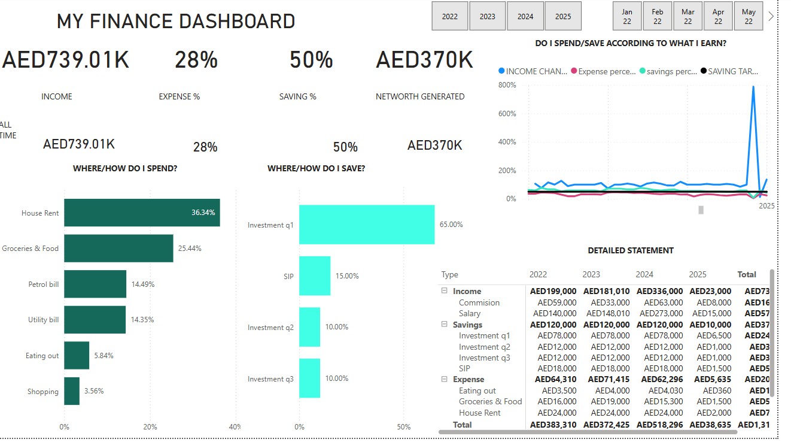

# Finance_Dashboard
# 💰 My Finance Dashboard

## Overview

This project presents a **Finance Dashboard** built to visualize and track personal income, expenses, and savings over time. The dashboard helps provide insights into financial health and investment strategies.

---

## 📊 Key Highlights

- **Total Income**: AED 739,010
- **Expense %**: 28%
- **Savings %**: 50%
- **Net Worth Generated**: AED 370,000

---

## 🧾 Breakdown

### 🏠 Where/How Do I Spend?
- **House Rent**: 36.34%
- **Groceries & Food**: 25.44%
- **Petrol Bill**: 14.49%
- **Utility Bill**: 14.35%
- **Eating Out**: 5.84%
- **Shopping**: 3.56%

### 💼 Where/How Do I Save?
- **Investment Q1**: 65%
- **SIP**: 15%
- **Investment Q2**: 10%
- **Investment Q3**: 10%

---

## 📈 Trends & Tracking

The dashboard includes:
- Year-over-year trends from **2022 to 2025**
- A line chart comparing **income changes, expense %, savings %, and saving targets**
- A **detailed financial statement** summarizing income, savings, and expenses

---

## 📂 Files Included

- `finance.png` – A snapshot of the dashboard
- `README.md` – Project description

---

## 🔧 Tools Used

- Microsoft Power BI for data visualization
- Excel or CSV files (not included) as the data source

---

## 💡 Purpose

This dashboard serves as a personal finance tracker and can be adapted for:
- Monthly or yearly financial reviews
- Expense control and investment planning
- Achieving savings targets

---

